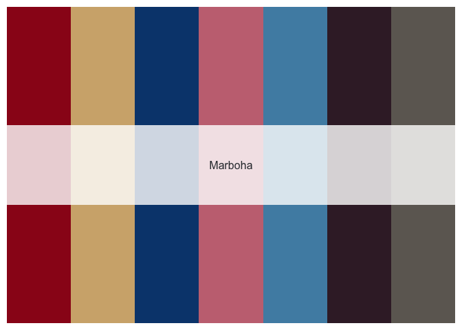
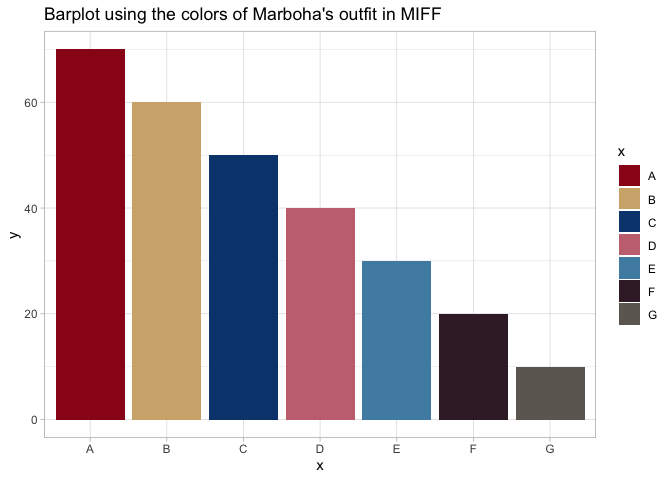

<!-- README.md is generated from README.Rmd. Please edit that file -->

# Marboha in Mazarita International Film Festival 2022

<!-- badges: start -->
<!-- badges: end -->

`Marboha` is an R package to provide a color palette based on Marboha’s
outfit in the Mazarita International Film Festival 2022




## Installation

You can install the development version of `Marboha` from
[GitHub](https://github.com/) with:

``` r
# install.packages("devtools")
devtools::install_github("ahmedmoustafa/Marboha")
```

## Example

### A barplot with `Marboha`

``` r
library(Marboha)
library(ggplot2)

x = c("A", "B", "C", "D", "E", "F", "G")
y = c(70, 60, 50, 40, 30, 20, 10)

ggplot() +
  geom_bar(aes(x = x, y = y, fill = x), stat = "identity") +
  theme_light() +
  scale_fill_manual(values = Marboha()) +
  ggtitle("Barplot using the colors of Marboha's outfit in MIFF")
```


